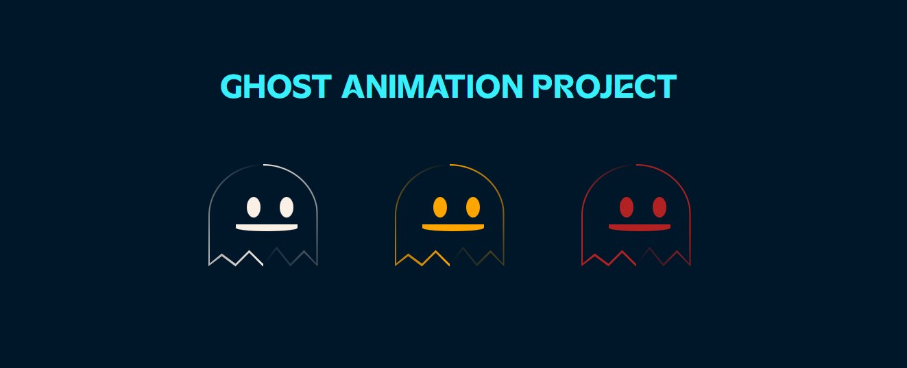

## [Ghost Animation]: A Vibrant HTML & CSS Animation



Bring your web pages to life with this captivating animation project built entirely with HTML and CSS!  This repository showcases the power of these fundamental web development technologies to create engaging and interactive user experiences.

**Features:**
   * Smooth and seamless animations using CSS transitions and animations 
   * Interactive elements that respond to user hover 
   * Creative use of CSS properties like `transform`, `opacity`, and `background` to achieve dynamic effects 
   * Clean and maintainable code structure for easy understanding and modification

**Getting Started:**

1. **Clone the Repository:**

   ```bash
   [git clone https://github.com/TemesgenMeles/Ghost-Animation-with-Html-and-CSS.git](https://github.com/TemesgenMeles/Ghost-Animation-with-Html-and-CSS.git)

2. **Open in a Text Editor:** Use your preferred code editor (e.g., Visual Studio Code, Sublime Text) to open the project files.
3. **Run the Project:** Open the index.html file in your web browser to view the animation.

**Contributing:**

   * Feel free to fork this repository and experiment with the code!
   * We welcome pull requests for improvements, bug fixes, and creative additions.
   * Please follow best practices for code formatting and commenting to maintain readability.
